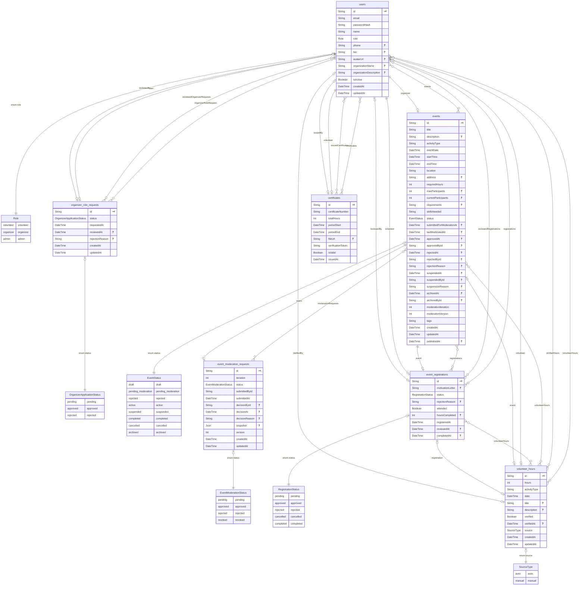

```mermaid
erDiagram

        Role {
            volunteer volunteer
organizer organizer
admin admin
        }
    


        OrganizerApplicationStatus {
            pending pending
approved approved
rejected rejected
        }
    


        EventStatus {
            draft draft
pending_moderation pending_moderation
rejected rejected
active active
suspended suspended
completed completed
cancelled cancelled
archived archived
        }
    


        EventModerationStatus {
            pending pending
approved approved
rejected rejected
revoked revoked
        }
    


        RegistrationStatus {
            pending pending
approved approved
rejected rejected
cancelled cancelled
completed completed
        }
    


        SourceType {
            auto auto
manual manual
        }
    
  "users" {
    String id "🗝️"
    String email 
    String passwordHash 
    String name 
    Role role 
    String phone "❓"
    String bio "❓"
    String avatarUrl "❓"
    String organizationName "❓"
    String organizationDescription "❓"
    Boolean isActive 
    DateTime createdAt 
    DateTime updatedAt 
    }
  

  "organizer_role_requests" {
    String id "🗝️"
    OrganizerApplicationStatus status 
    DateTime requestedAt 
    DateTime reviewedAt "❓"
    String rejectionReason "❓"
    DateTime createdAt 
    DateTime updatedAt 
    }
  

  "events" {
    String id "🗝️"
    String title 
    String description "❓"
    String activityType 
    DateTime eventDate 
    DateTime startTime 
    DateTime endTime 
    String location 
    String address "❓"
    Int requiredHours 
    Int maxParticipants "❓"
    Int currentParticipants "❓"
    String requirements "❓"
    String skillsNeeded 
    EventStatus status 
    DateTime submittedForModerationAt "❓"
    DateTime lastModeratedAt "❓"
    DateTime approvedAt "❓"
    String approvedById "❓"
    DateTime rejectedAt "❓"
    String rejectedById "❓"
    String rejectionReason "❓"
    DateTime suspendedAt "❓"
    String suspendedById "❓"
    String suspensionReason "❓"
    DateTime archivedAt "❓"
    String archivedById "❓"
    Int moderationIteration 
    Int moderationVersion 
    String tags 
    DateTime createdAt 
    DateTime updatedAt 
    DateTime publishedAt "❓"
    }
  

  "event_moderation_requests" {
    String id "🗝️"
    Int iteration 
    EventModerationStatus status 
    String submittedById 
    DateTime submittedAt 
    String decisionById "❓"
    DateTime decisionAt "❓"
    String decisionReason "❓"
    Json snapshot "❓"
    Int version 
    DateTime createdAt 
    DateTime updatedAt 
    }
  

  "event_registrations" {
    String id "🗝️"
    String motivationLetter "❓"
    RegistrationStatus status 
    String rejectionReason "❓"
    Boolean attended 
    Int hoursCompleted "❓"
    DateTime registeredAt 
    DateTime reviewedAt "❓"
    DateTime completedAt "❓"
    }
  

  "volunteer_hours" {
    String id "🗝️"
    Int hours 
    String activityType 
    DateTime date 
    String title "❓"
    String description "❓"
    Boolean verified 
    DateTime verifiedAt "❓"
    SourceType source 
    DateTime createdAt 
    DateTime updatedAt 
    }
  

  "certificates" {
    String id "🗝️"
    String certificateNumber 
    Int totalHours 
    DateTime periodStart 
    DateTime periodEnd 
    String fileUrl "❓"
    String verificationToken 
    Boolean isValid 
    DateTime issuedAt 
    }
  
    "users" o|--|| "Role" : "enum:role"
    "users" o{--}o "events" : "events"
    "users" o{--}o "event_registrations" : "registrations"
    "users" o{--}o "volunteer_hours" : "volunteerHours"
    "users" o{--}o "certificates" : "certificates"
    "users" o{--}o "volunteer_hours" : "verifiedHours"
    "users" o{--}o "event_registrations" : "reviewedRegistrations"
    "users" o{--}o "certificates" : "issuedCertificates"
    "users" o{--}o "organizer_role_requests" : "organizerRoleRequest"
    "users" o{--}o "organizer_role_requests" : "reviewedOrganizerRequests"
    "organizer_role_requests" o|--|| "OrganizerApplicationStatus" : "enum:status"
    "organizer_role_requests" o|--|| "users" : "user"
    "organizer_role_requests" o|--|o "users" : "reviewedBy"
    "events" o|--|| "EventStatus" : "enum:status"
    "events" o|--|| "users" : "organizer"
    "events" o{--}o "event_registrations" : "registrations"
    "events" o{--}o "volunteer_hours" : "volunteerHours"
    "events" o{--}o "event_moderation_requests" : "moderationRequests"
    "event_moderation_requests" o|--|| "EventModerationStatus" : "enum:status"
    "event_moderation_requests" o|--|| "events" : "event"
    "event_registrations" o|--|| "RegistrationStatus" : "enum:status"
    "event_registrations" o|--|| "events" : "event"
    "event_registrations" o|--|| "users" : "volunteer"
    "event_registrations" o|--|o "users" : "reviewedBy"
    "event_registrations" o{--}o "volunteer_hours" : "volunteerHours"
    "volunteer_hours" o|--|| "SourceType" : "enum:source"
    "volunteer_hours" o|--|| "users" : "volunteer"
    "volunteer_hours" o|--|o "events" : "event"
    "volunteer_hours" o|--|o "event_registrations" : "registration"
    "volunteer_hours" o|--|o "users" : "verifiedBy"
    "certificates" o|--|| "users" : "volunteer"
    "certificates" o|--|o "users" : "issuedBy"
```
